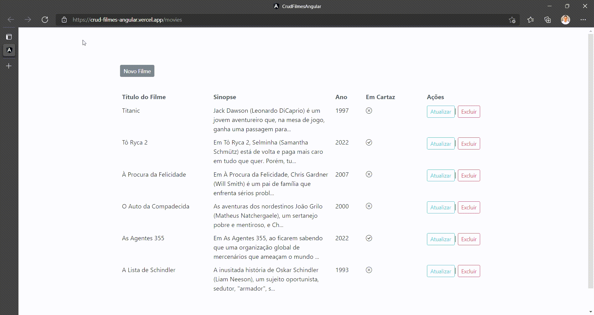

<h1 align="center">
     
        
     
    Crud Angular | Filmes
</h1>

    Clique no link a seguir para acessar a aplicação: 
    <strong><a href="https://crud-filmes-angular.vercel.app/movies" target="_blank">crud-filmes-angular.vercel.app/movies</a></strong>

## 🧑🏽‍💻 O Projeto:

    Neste projeto desenvolvi um Crud em Angular 13.
     
    No lado back-end foi construida uma API .NET Core (atualmente localhost) que serve os dados para a aplicação front-end Angular, estes dados são salvos em uma base SQL Server (atualmente local).

    <strong>**OBS:</strong> 
    

        A aplicação front-end Angular está hospedada em um servidor Vercel, porém a API consumida pelo front não está hospedada (atualmente),
        por este motivo ao acessar a aplicação não será possível realizar as operações de CRUD. (para ver o funcionamento da aplicação 
        veja abaixo a sessão <strong>Demostração</strong>). 
    

## 💻 Demostração:

    

## :octocat: Clone API | Teste Funcional da Aplicação:

    

        Para testar o funcionamento da aplicação atualmente é necessário realizar o clone da API e seguir os passos abaixo: 
         
         
        1. Realizar o Clone da API (link do repositório: <strong><a href="https://github.com/ivisconfessor/crud-filmes-api-aspnetcore" target="_blank">https://github.com/ivisconfessor/crud-filmes-api-aspnetcore</a></strong>) 
         
         
        2. Rodar o comando de Entity Framework (dotnet -ef database update)
         
         
        3. Executar a aplicação com o comando: dotnet run (Obs. rodar a aplicação na porta 7016)
    

    <strong>**OBS:</strong> 
    

        Como foi dito na sessão acima <strong>O Projeto</strong>, a API responsável por manipular os dados dos filmes não está hospedada. Além de ser necessário ter o Runtime do .NET instaldo em sua máquina, também é necessário ter uma instância de uma base local SQL Server para armazenamento dos dados.
    

## 🚀 Tecnologias usadas:

✔️ Angular 13

✔️ Node / NPM / Angular CLI

✔️ TypeScript

✔️ JavaScript

✔️ HTML

✔️ CSS

✔️ Bootstrap

    Feito com ❤️ por <strong><a href="https://github.com/ivisconfessor">Ivís Confessor</a></strong> 

